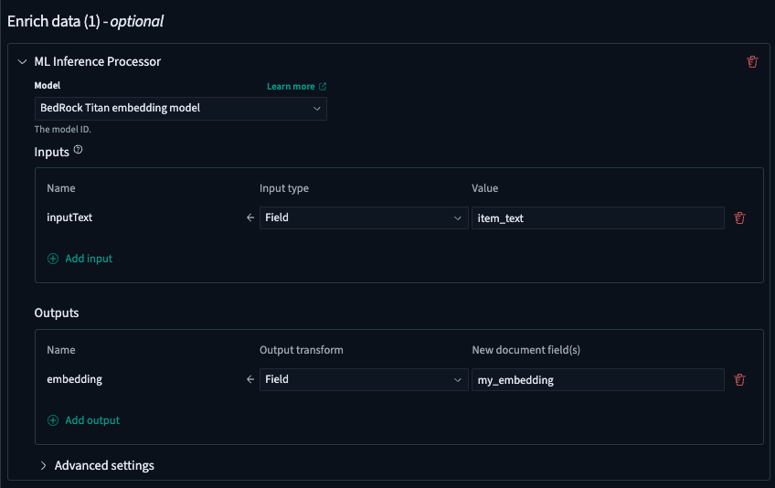
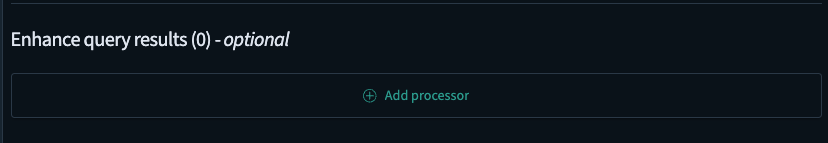

The following tutorial is an accurate representation of the experimental OpenSearch Flow OSD Plugin as of 11/27/2024, based on OSD 2.18.

Changelog:

- Initially created 11/18/2024
- Updated on 11/27/2024 after input/output transform design was overhauled. See PR #504

# Tutorial

For an overview of the plugin, please see [README](../README.md)

## 1. Provision ML resources

This plugin is not responsible for connector/model creation, this should be done separately. For several examples that cover a variety of vector search & RAG use cases, see the preset connector blueprints [here](https://opensearch.org/docs/latest/ml-commons-plugin/api/model-apis/register-model/#connector-model-interfaces). For more general information on the ML plugin, connectors, and models, see the [ML Commons plugin documentation](https://opensearch.org/docs/latest/ml-commons-plugin/). You should have deployed remote models with sufficient model interfaces available. These will be the models used for stitching together your ingest and search flows for different use cases.

## 2. Navigate to the plugin on OSD

The "OpenSearch Flow" plugin will be under "Search" in the side navigation on OSD. Click to enter the plugin home page.


## 3. Select your use case

Start by selecting a preset template for your particular use case. If you want to first test out some basic use cases, you may choose one of the preset templates. You can fill out some initial information about your use case, such as the model, and some of the different input fields. It is all optional, but will help auto-populate some of the configuration if provided. If you anticipate a more advanced/custom use case, you can choose "Custom", which will provide a blank slate, letting you build out all of your configuration from scratch.

The below screenshots will illustrate a basic semantic search use case starting from scratch.


## 4. Get familiar with the Workflow Details page

After selecting, you will enter the Workflow Details page. This page is broken down into 3 main sections:

1. The form. This is where you will spend most of your time, configuring your ingest and search pipelines. It is split into 2 main steps - first configuring your ingest flow, and secondly, configuring your search flow. We will go into more detail on these later.


2. The preview workspace. This is a read-only workspace, provided as a visual helper to see how your data flows & is transformed across ingest & search. You can toggle to the JSON view to get more details on the underlying resource configurations as you build your flows out.


3. The inspector. You can think of this similar to an IDE - it provides different information as you build out your flows, including the responses after running ingest / search, any errors seen while testing, and the list of underlying created resources for this particular workflow.


4. Header buttons

These allow you to undo current changes, save your current form, export your workflow, or exit and return to the homepage. NOTE: depending on the OSD configuration `useNewHomePage` feature flag), these buttons may look different.


## 5. Provide some sample data

Now we can begin building the use case! Let's start by providing some sample data. The data should be in a JSON array format. 3 options are provided for your convenience: manual input, importing from a file, or taking some sample data from an existing index. _Note if you already have sample data and are only interested in adding search functionality, you can skip this step entirely by un-checking the "Enabled" checkbox. This will let you navigate directly to the search flow_.

For this example, we will manually input some sample data containing various clothing items.


## 6. Enrich your data

You can now enrich your data by building out an ingest pipeline & chaining together different ingest processors. The current list of supported processors is visible in the dropdown when clicking "Add processor".


Continuing with the semantic search example, you can now select and configure an ML inference processor to embed the input text. This cluster has a deployed Amazon Bedrock Titan text embedding model. The model has a defined interface, and expects a single input called `inputText`, and returns a single output called `embedding`.

This is where you can now map data to and from the model inputs and outputs, respectively. "Inputs" allows selecting and transforming the data to conform to the expected model inputs. "Outputs" allows selecting and transforming the model outputs to new fields. There are different types of transformations you can do, including field-level mapping (extracting out a document field value), expressions (more complex transformations using [JSONPath](https://en.wikipedia.org/wiki/JSONPath)), and others. For this example, you can just select the `item_text` field to map to the `inputText` model input, and map the output `embedding` field to a new document field called `my_embedding`. _(Behind the scenes, this is configuring the "input_map" and "output_map" configuration settings for [ML inference ingest processors](https://opensearch.org/docs/latest/ingest-pipelines/processors/ml-inference/))_



Click "Save" to return to the form.

### Aside: advanced data transformations

Continuing with the above example, let's suppose the input data (the document) is more complex, and a simple field-level mapping is not sufficient. Maybe you need to parse out some nested field's value. This can be done by changing the transform type to `Expression`


From there, click "Configure" to open the "Extract data with expression" modal. On the right-hand side, you can click "Run preview" to fetch the input data to this processor.


On the left-hand side, you can define a [JSONPath](https://en.wikipedia.org/wiki/JSONPath) transform to parse out the data you want. Suppose it is the description, "red shoes". You can write some JSONPath to pull out this data - `$.item.description`. The transformed value will appear under the "Extracted data" box in the lower-right-hand corner as you define your JSONPath. For models with defined [JSON Schema](https://json-schema.org/) interfaces, you will see a marker indicating whether the transform is valid or invalid for that particular model field (in this case, `inputText`):


## 7. Ingest data

Ensure your index configurations are up-to-date, and optionally enter an index name. For vector search use cases like in this example, ensure any vector fields are mapped as such, and with appropriate vector dimensions. Additionally, the index settings should ensure this is labeled as a knn index. Note that for preset use cases (non-"Custom" use cases), many of this will be automatically populated for your convenience.


After configuring, click "Build and run ingestion". This will build out your index, ingest pipeline, and finally bulk ingest your sample documents. The OpenSearch response will be visible under the Inspector panel, as well as any errors if they should occur.


You have now completed your ingest flow! Let's move on to configuring search by clicking the "Search pipeline >" button.

## 8. Configure query

The query is the starting point for your search flow. Note the index is already set to the one you've configured from the ingest flow _(NOTE: if you skipped ingest, a dropdown will be available to select from an existing index)_. You can select from some preset options as a starting point, and fully configure your query. Continuing with this semantic search example, we will follow this standard vector search pattern:

1. Provide a query containing the data you need to generate embeddings for

2. (Step 9 - see below) Configure an ML inference processor to parse the input data, generate vector embedding(s), and create a knn query using the generated vector(s)

So, we will provide a basic term query with the input data to be vectorized here:


## 9. Enrich query request

Similar to Step 6 - Enrich data, this allows you to enrich the query request by configuring a series of processors - in this case, [search request processors](https://opensearch.org/docs/latest/search-plugins/search-pipelines/search-processors/#search-request-processors). Currently, only the ML inference processor is supported. Continuing with the semantic search example, we will configure an ML processor using the same Titan text embedding model. First, configure the input and output mappings to generate the vector, similar to what was done on the ingest side. Specifically, here we select the query value containing the text we want to embed, "shoes". And, we map the embedding to some field called "vector".


Next, we need to update our query to use this generated vector embedding. Click "Override query" to open the modal. We can select a knn query preset to start.


From there, populate any placeholder values, such as "${vector_field}" with the associated vector field you have in your index. In this case, "my_embedding" that we configured on ingest. To use the produced vector in the model output, we can see the list of available model outputs under "Model outputs". There is a utility copy button on the right-hand side to copy the template variable. Inject/paste this variable anywhere in the query to dynamically inject it into the query at runtime. In this example, it has already populated "${vector}" as the "vector" value for the knn query, so there is nothing left to do. The final query should have no placeholders, besides any model output dynamic variables that will be populated at runtime.


## 10. Enrich query results

Similar to Step 9 - Enrich query request, we can configure a series of [search response processors](https://opensearch.org/docs/latest/search-plugins/search-pipelines/search-processors/#search-response-processors) to enrich/transform the returned matching documents. For this particular example, this is not needed. _For more examples using search response processors, see "More examples" below, including RAG & reranking use cases which involve processing & manipulating the search response._



## 11. Execute search

We are finished configuring! Now click "Build and run query" to build out the search pipeline and execute the search request against the index. The final results will pop up in the "Inspector" panel. For this example, we see the top results pertaining to shoes.


## 12. Export workflow

If you are satisfied with the final workflow and the results it is producing, you can click the "Export" button in the header. This will open a modal, showing you the end-to-end [workflow template](https://opensearch.org/docs/latest/automating-configurations/workflow-templates/) containing all of the configuration details for your index, ingest pipeline, and search pipeline, as well as associated UI metadata (for example, certain things like the search request are not concrete resources - we persist them here for ease-of-use if importing this template on the UI). It can be copied in JSON or YAML format. Note: any cluster-specific IDs, such as model IDs, will need to be updated, if importing into a different cluster.


And that's it! If you have followed all of these steps, you now have a successful semantic search use case, with all of the required resources bundled up into a single template. You can import this template on the UI and rebuild for different clusters, or execute directly using the [Flow Framework Provision API](https://opensearch.org/docs/latest/automating-configurations/api/provision-workflow/).

# More examples

## 1. Semantic search

### Connector (Bedrock Titan text embedding model)

```
POST /_plugins/_ml/connectors/_create
{
    "name": "Amazon Bedrock - Titan",
    "description": "The connector to Bedrock Titan embedding model",
    "version": 1,
    "protocol": "aws_sigv4",
    "credential": {
        "access_key": "",
        "secret_key": "",
        "session_token": ""
    },
    "parameters": {
        "region": "<region>",
        "service_name": "bedrock",
        "model": "amazon.titan-embed-text-v1"
    },
    "actions": [
        {
            "action_type": "predict",
            "method": "POST",
            "url": "https://bedrock-runtime.${parameters.region}.amazonaws.com/model/${parameters.model}/invoke",
            "headers": {
                "content-type": "application/json",
                "x-amz-content-sha256": "required"
            },
            "request_body": "{ \"inputText\": \"${parameters.inputText}\" }"
        }
    ]
}
```

### Model & model interface

```
POST /_plugins/_ml/models/_register
{
    "name": "BedRock Titan Text Embedding Model",
    "version": "1.0.1",
    "function_name": "remote",
    "description": "",
    "connector_id": "<connector-id>",
    "interface": {
        "input": {
            "type": "object",
            "properties": {
                "parameters": {
                    "type": "object",
                    "properties": {
                        "inputText": {
                            "type": "string"
                        }
                    },
                    "additionalProperties": true,
                    "required": [
                        "inputText"
                    ]
                }
            }
        },
        "output": {
            "type": "object",
            "properties": {
                "inference_results": {
                    "type": "array",
                    "items": {
                        "type": "object",
                        "properties": {
                            "output": {
                                "type": "array",
                                "items": {
                                    "type": "object",
                                    "properties": {
                                        "name": {
                                            "type": "string"
                                        },
                                        "dataAsMap": {
                                            "type": "object",
                                            "properties": {
                                                "embedding": {
                                                    "type": "array"
                                                }
                                            },
                                            "required": [
                                                "embedding"
                                            ]
                                        }
                                    },
                                    "required": [
                                        "name",
                                        "dataAsMap"
                                    ]
                                }
                            },
                            "status_code": {
                                "type": "integer"
                            }
                        },
                        "required": [
                            "output",
                            "status_code"
                        ]
                    }
                }
            },
            "required": [
                "inference_results"
            ]
        }
    }
}
```

### Index

Ensure the index settings include `index.knn: true`, & mappings have a `knn_vector` field - something like the following:

```
"<embedding_field_name>": {
    "type": "knn_vector",
    "dimension": <embedding_size>
}
```

### Ingest pipeline

Single ML inference processor. Map your input text to the `inputText` model input field. Optionally map the output `embedding` to a new document field.

### Search pipeline

Single ML inference **search request** processor. Map the query field containing the input text to the `inputText` model input field. Optionally map the output `embedding` to a new field. Override the query to a knn query. For example:

```
{
    "_source": {
        "excludes": [
            "<embedding_field>"
        ]
    },
    "query": {
        "knn": {
            "<embedding_field>": {
                "vector": ${embedding},
                "k": 10
            }
        }
    }
}
```

---

## 2. Hybrid search (BM25 + k-NN)

### Connector (Bedrock Titan text embedding model)

```
POST /_plugins/_ml/connectors/_create
{
    "name": "Amazon Bedrock - Titan",
    "description": "The connector to Bedrock Titan embedding model",
    "version": 1,
    "protocol": "aws_sigv4",
    "credential": {
        "access_key": "",
        "secret_key": "",
        "session_token": ""
    },
    "parameters": {
        "region": "<region>",
        "service_name": "bedrock",
        "model": "amazon.titan-embed-text-v1"
    },
    "actions": [
        {
            "action_type": "predict",
            "method": "POST",
            "url": "https://bedrock-runtime.${parameters.region}.amazonaws.com/model/${parameters.model}/invoke",
            "headers": {
                "content-type": "application/json",
                "x-amz-content-sha256": "required"
            },
            "request_body": "{ \"inputText\": \"${parameters.inputText}\" }"
        }
    ]
}
```

### Model & model interface

```
POST /_plugins/_ml/models/_register
{
    "name": "BedRock Titan Text Embedding Model",
    "version": "1.0.1",
    "function_name": "remote",
    "description": "",
    "connector_id": "<connector-id>",
    "interface": {
        "input": {
            "type": "object",
            "properties": {
                "parameters": {
                    "type": "object",
                    "properties": {
                        "inputText": {
                            "type": "string"
                        }
                    },
                    "additionalProperties": true,
                    "required": [
                        "inputText"
                    ]
                }
            }
        },
        "output": {
            "type": "object",
            "properties": {
                "inference_results": {
                    "type": "array",
                    "items": {
                        "type": "object",
                        "properties": {
                            "output": {
                                "type": "array",
                                "items": {
                                    "type": "object",
                                    "properties": {
                                        "name": {
                                            "type": "string"
                                        },
                                        "dataAsMap": {
                                            "type": "object",
                                            "properties": {
                                                "embedding": {
                                                    "type": "array"
                                                }
                                            },
                                            "required": [
                                                "embedding"
                                            ]
                                        }
                                    },
                                    "required": [
                                        "name",
                                        "dataAsMap"
                                    ]
                                }
                            },
                            "status_code": {
                                "type": "integer"
                            }
                        },
                        "required": [
                            "output",
                            "status_code"
                        ]
                    }
                }
            },
            "required": [
                "inference_results"
            ]
        }
    }
}
```

### Index

Ensure the index settings include `index.knn: true`, & mappings have a `knn_vector` field - something like the following:

```
"<embedding_field_name>": {
    "type": "knn_vector",
    "dimension": <embedding_size>
}
```

### Ingest pipeline

Single ML inference processor. Map your input text to the `inputText` model input field. Optionally map the output `embedding` to a new document field.

### Search pipeline

An ML inference **search request** processor & normalization processor.

**For the ML inference processor:**

Map the query field containing the input text to the `inputText` model input field. Optionally map the output `embedding` to a new field. Override the query to a hybrid query. See example below. Ensure to set the `embedding_field`, `text_field`, & `text_field_input`:

```
{
    "_source": {
        "excludes": [
            "<embedding_field>"
        ]
    },
    "query": {
        "hybrid": {
            "queries": [
                {
                    "match": {
                        "<text_field>": {
                            "query": "<text_field_input>"
                        }
                    }
                },
                {
                    "knn": {
                        "<embedding_field>": {
                            "vector": ${embedding},
                            "k": 10
                        }
                    }
                }
            ]
        }
    }
}
```

**For the normalization processor:**

Configure weights for each sub-query. You may refer to the [hybrid search normalization processor example](https://opensearch.org/docs/latest/search-plugins/hybrid-search/#step-4-configure-a-search-pipeline) for reference.

---

## 3. Basic RAG (document summarization)

NOTE: the below connector blueprint & model interface may change over time. The following example uses a connector blueprint that abstracts a lot of the complexity around the [Claude v1 messages API](https://docs.anthropic.com/en/api/getting-started#examples), exposing only a single `prompt` field as input in the model. An example input may look like the following, with placeholders containing dynamically-fetched results:

```
{
  "prompt": "Human: You are a professional data analyst. You are given a list of document results. You will analyze the data and generate a human-readable summary of the results. If you don't know the answer, just say I don't know.\n\n Results: ${parameters.results.toString()}\n\n Human: Please summarize the results.\n\n Assistant:"
}
```

### Connector (Bedrock Claude V3 model)

```
POST /_plugins/_ml/connectors/_create
{
    "name": "Amazon Bedrock - Claude v3",
    "description": "Connector for Amazon Bedrock Claude v3",
    "version": 1,
    "protocol": "aws_sigv4",
    "credential": {
      "access_key": "",
      "secret_key": "",
      "session_token": ""
    },
    "parameters": {
        "region": "<region>",
        "service_name": "bedrock",
        "auth": "Sig_V4",
        "response_filter": "$.content[0].text",
        "max_tokens_to_sample": "8000",
        "anthropic_version": "bedrock-2023-05-31",
        "model": "anthropic.claude-3-sonnet-20240229-v1:0",
        "prompt": ""
    },
    "actions": [
        {
            "action_type": "predict",
            "method": "POST",
            "headers": {
                "content-type": "application/json"
            },
            "url": "https://bedrock-runtime.${parameters.region}.amazonaws.com/model/${parameters.model}/invoke",
            "request_body": "{\"messages\":[{\"role\":\"user\",\"content\":[{\"type\":\"text\",\"text\":\"${parameters.prompt}\"}]}],\"anthropic_version\":\"${parameters.anthropic_version}\",\"max_tokens\":${parameters.max_tokens_to_sample}}"
        }
    ]
}
```

### Model & model interface

```
POST /_plugins/_ml/models/_register
{
    "name": "Bedrock - Claude V3",
    "version": "1.0.1",
    "function_name": "remote",
    "description": "",
    "connector_id": "<connector_id>",
    "interface": {
        "input": {
            "type": "object",
            "properties": {
                "parameters": {
                    "type": "object",
                    "properties": {
                        "prompt": {
                            "type": "string",
                            "description": "The prompt."
                        }
                    },
                    "additionalProperties": true,
                    "required": [
                        "prompt"
                    ]
                }
            }
        },
        "output": {
            "type": "object",
            "properties": {
                "inference_results": {
                    "type": "array",
                    "items": {
                        "type": "object",
                        "properties": {
                            "output": {
                                "type": "array",
                                "items": {
                                    "type": "object",
                                    "properties": {
                                        "name": {
                                            "type": "string"
                                        },
                                        "dataAsMap": {
                                            "type": "object",
                                            "properties": {
                                                "response": {
                                                    "type": "string"
                                                }
                                            },
                                            "required": [
                                                "response"
                                            ]
                                        }
                                    },
                                    "required": [
                                        "name",
                                        "dataAsMap"
                                    ]
                                }
                            },
                            "status_code": {
                                "type": "integer"
                            }
                        },
                        "required": [
                            "output",
                            "status_code"
                        ]
                    }
                }
            },
            "required": [
                "inference_results"
            ]
        }
    }
}
```

### Index

Nothing special needs to be configured.

### Ingest pipeline

Nothing special needs to be configured.

### Search pipeline

Single ML inference **search response** processor. Choose `Template` as the transform type for the `prompt` input field. Open up the template configuration by clicking "Configure". Select a preset to start with for your convenience. Then, create an input variable that parses out the list of reviews, something like `review`. Inject the variable into the prompt by copying and pasting it. Click "Run preview" to test that the final transformed prompt with sample dynamic data looks as expected. Click "Save" to save and exit.

---

## 4. Multimodal search (text & image)

### Connector (Bedrock Titan multimodal model, accepts images in base64 format)

```
POST /_plugins/_ml/connectors/_create
{
    "name": "Amazon Bedrock Connector: Titan multimodal model",
    "description": "The connector to bedrock Titan multi-modal embedding model",
    "version": 1,
    "protocol": "aws_sigv4",
    "parameters": {
        "region": "<region>",
        "service_name": "bedrock",
        "model": "amazon.titan-embed-image-v1",
        "input_docs_processed_step_size": 2
    },
    "credential": {
        "access_key": "",
        "secret_key": "",
        "session_token": ""
    },
    "actions": [
        {
            "action_type": "predict",
            "method": "POST",
            "url": "https://bedrock-runtime.${parameters.region}.amazonaws.com/model/${parameters.model}/invoke",
            "headers": {
                "content-type": "application/json",
                "x-amz-content-sha256": "required"
            },
            "request_body": "{\"inputText\": \"${parameters.inputText:-null}\", \"inputImage\": \"${parameters.inputImage:-null}\"}"
        }
    ]
}
```

### Model & model interface

```
POST /_plugins/_ml/models/_register
{
    "name": "Bedrock Titan multimodal model",
    "version": "1.0.1",
    "function_name": "remote",
    "description": "",
    "connector_id": "<connector_id>",
    "interface": {
        "input": {
            "type": "object",
            "properties": {
                "parameters": {
                    "type": "object",
                    "properties": {
                        "inputImage": {
                            "type": "string"
                        },
                        "inputText": {
                            "type": "string"
                        }
                    },
                    "additionalProperties": true,
                    "required": []
                }
            }
        },
        "output": {
            "type": "object",
            "properties": {
                "inference_results": {
                    "type": "array",
                    "items": {
                        "type": "object",
                        "properties": {
                            "output": {
                                "type": "array",
                                "items": {
                                    "type": "object",
                                    "properties": {
                                        "name": {
                                            "type": "string"
                                        },
                                        "dataAsMap": {
                                            "type": "object",
                                            "properties": {
                                                "embedding": {
                                                    "type": "array"
                                                }
                                            },
                                            "required": [
                                                "embedding"
                                            ]
                                        }
                                    },
                                    "required": [
                                        "name",
                                        "dataAsMap"
                                    ]
                                }
                            },
                            "status_code": {
                                "type": "integer"
                            }
                        },
                        "required": [
                            "output",
                            "status_code"
                        ]
                    }
                }
            },
            "required": [
                "inference_results"
            ]
        }
    }
}
```

### Index

Ensure the index settings include `index.knn: true`, & mappings have a `binary` field and `knn_vector` field to persist the image binaries and generated image embeddings, respectively. For example:

```
"image_base64": {
    "type": "binary"
},
"image_embedding": {
    "type": "knn_vector",
    "dimension": <dimension>
},
```

### Ingest pipeline

Single ML inference processor. Map your input text field and input image field to the `inputText` and `inputImage` model input fields, respectively. This is assuming both inputs are desired to generate a single embedding; alternatively, only one input (text or image) is technically required.

Optionally map the output `embedding` to a new document field.

### Search pipeline

Single ML inference **search request** processor. Map the input text field and input image field in the query, to the `inputText`and `inputImage` model input fields, respectively (again, assuming both inputs are desired, while only one or the other is required).

Override the query to a knn query, including the embedding output. For example:

```
{
    "_source": {
        "excludes": [
            "<embedding_field>"
        ]
    },
    "query": {
        "knn": {
            "<embedding_field>": {
                "vector": ${embedding},
                "k": 10
            }
        }
    }
}
```

---

## 5. Named entity recognition (NER)

### Connector (Amazon Comprehend)

```
POST /_plugins/_ml/connectors/_create
{
    "name": "Amazon Comprehend Connector",
    "description": "Connector for Amazon Comprehend model",
    "version": 1,
    "protocol": "aws_sigv4",
    "credential": {
        "access_key": "",
        "secret_key": "",
        "session_token": ""
    },
    "parameters": {
        "service_name": "comprehend",
        "region": "<region>",
        "api_version": "20171127",
        "api_name": "DetectEntities",
        "api": "Comprehend_${parameters.api_version}.${parameters.api_name}",
        "response_filter": "$",
        "language_code": "en"
    },
    "actions": [
        {
            "action_type": "predict",
            "method": "POST",
            "url": "https://${parameters.service_name}.${parameters.region}.amazonaws.com",
            "headers": {
                "X-Amz-Target": "${parameters.api}",
                "content-type": "application/x-amz-json-1.1"
            },
            "request_body": "{ \"Text\": \"${parameters.text}\", \"LanguageCode\": \"${parameters.language_code}\"}"
        }
    ]
}
```

### Model & model interface

```
POST /_plugins/_ml/models/_register
{
    "name": "Amazon Comprehend entity recognition model",
    "version": "1.0.1",
    "function_name": "remote",
    "description": "",
    "connector_id": "<connector_id>",
    "interface": {
        "input": {
            "type": "object",
            "properties": {
                "parameters": {
                    "type": "object",
                    "properties": {
                        "text": {
                            "type": "string"
                        }
                    },
                    "additionalProperties": true,
                    "required": [
                        "text"
                    ]
                }
            }
        },
        "output": {
            "type": "object",
            "properties": {
                "inference_results": {
                    "type": "array",
                    "items": {
                        "type": "object",
                        "properties": {
                            "output": {
                                "type": "array",
                                "items": {
                                    "type": "object",
                                    "properties": {
                                        "name": {
                                            "type": "string"
                                        },
                                        "dataAsMap": {
                                            "type": "object",
                                            "properties": {
                                                "response": {
                                                    "type": "object",
                                                    "properties": {
                                                        "Entities": {
                                                            "type": "array",
                                                            "items": {
                                                                "type": "object",
                                                                "properties": {
                                                                    "BeginOffset": {
                                                                        "type": "integer"
                                                                    },
                                                                    "EndOffset": {
                                                                        "type": "integer"
                                                                    },
                                                                    "Score": {
                                                                        "type": "number"
                                                                    },
                                                                    "Text": {
                                                                        "type": "string"
                                                                    },
                                                                    "Type": {
                                                                        "type": "string"
                                                                    }
                                                                },
                                                                "required": [
                                                                    "BeginOffset",
                                                                    "EndOffset",
                                                                    "Score",
                                                                    "Text",
                                                                    "Type"
                                                                ],
                                                                "additionalProperties": true
                                                            }
                                                        }
                                                    },
                                                    "required": [
                                                        "Entities"
                                                    ],
                                                    "additionalProperties": true
                                                }
                                            }
                                        }
                                    },
                                    "required": [
                                        "name",
                                        "dataAsMap"
                                    ]
                                }
                            },
                            "status_code": {
                                "type": "integer"
                            }
                        },
                        "required": [
                            "output",
                            "status_code"
                        ]
                    }
                }
            },
            "required": [
                "inference_results"
            ]
        }
    }
}
```

### Index

Nothing special needs to be configured.

### Ingest pipeline

Single ML inference processor. Map your input text field to the `text` model input fields. Suppose you want to persist any found entities with each document. In this case, you can transform the output (an array of Entities), and persist them under an `entities_found` field. You may use the following output_map configuration as a reference.

```
"output_map": [
            {
              "entities_found": "$.response.Entities[*].Type"
            }
],
```

### Search pipeline

Nothing special needs to be configured.

---

## 6. Language detection / classification

### Connector (Amazon Comprehend)

```
POST /_plugins/_ml/connectors/_create
{
    "name": "Amazon Comprehend connector",
    "description": "Connector for Amazon Comprehend",
    "version": 1,
    "protocol": "aws_sigv4",
    "credential": {
        "access_key": "",
        "secret_key": "",
        "session_token": ""
    },
    "parameters": {
        "service_name": "comprehend",
        "region": "<region>",
        "api_version": "20171127",
        "api_name": "DetectDominantLanguage",
        "api": "Comprehend_${parameters.api_version}.${parameters.api_name}",
        "response_filter": "$"
    },
    "actions": [
        {
            "action_type": "predict",
            "method": "POST",
            "url": "https://${parameters.service_name}.${parameters.region}.amazonaws.com",
            "headers": {
                "X-Amz-Target": "${parameters.api}",
                "content-type": "application/x-amz-json-1.1"
            },
            "request_body": "{ \"Text\": \"${parameters.text}\"}"
        }
    ]
}
```

### Model & model interface

```
POST /_plugins/_ml/models/_register
{
    "name": "Amazon Comprehend language detection model",
    "version": "1.0.1",
    "function_name": "remote",
    "description": "",
    "connector_id": "<connector_id",
    "interface": {
        "input": {
            "type": "object",
            "properties": {
                "parameters": {
                    "type": "object",
                    "properties": {
                        "text": {
                            "type": "string"
                        }
                    },
                    "additionalProperties": true,
                    "required": [
                        "text"
                    ]
                }
            }
        },
        "output": {
            "type": "object",
            "properties": {
                "inference_results": {
                    "type": "array",
                    "items": {
                        "type": "object",
                        "properties": {
                            "output": {
                                "type": "array",
                                "items": {
                                    "type": "object",
                                    "properties": {
                                        "name": {
                                            "type": "string"
                                        },
                                        "dataAsMap": {
                                            "type": "object",
                                            "properties": {
                                                "response": {
                                                    "type": "object",
                                                    "properties": {
                                                        "Languages": {
                                                            "type": "array",
                                                            "items": {
                                                                "type": "object",
                                                                "properties": {
                                                                    "LanguageCode": {
                                                                        "type": "string"
                                                                    },
                                                                    "Score": {
                                                                        "type": "number"
                                                                    }
                                                                },
                                                                "required": [
                                                                    "LanguageCode",
                                                                    "Score"
                                                                ],
                                                                "additionalProperties": true
                                                            }
                                                        }
                                                    },
                                                    "required": [
                                                        "Languages"
                                                    ],
                                                    "additionalProperties": true
                                                }
                                            }
                                        }
                                    },
                                    "required": [
                                        "name",
                                        "dataAsMap"
                                    ]
                                }
                            },
                            "status_code": {
                                "type": "integer"
                            }
                        },
                        "required": [
                            "output",
                            "status_code"
                        ]
                    }
                }
            },
            "required": [
                "inference_results"
            ]
        }
    }
}
```

### Index

Nothing special needs to be configured.

### Ingest pipeline

Single ML inference processor. Map your input text field to the `text` model input fields. Suppose you want to persist the most relevant / most likely language for each document. In this case, you can transform the output (an array of Languages), and persist them under a `detected_dominant_language` field. You may use the following output_map configuration as a reference.

```
"output_map": [
    {
              "detected_dominant_language": "response.Languages[0].LanguageCode"
    }
],
```

### Search pipeline

Nothing special needs to be configured.

---

## 7. Reranking results

Reranking can be achieved in many different ways. Typically, the models will take in at least 2 inputs; one with the original query/input, and one with the data to assign a relevance score to. Some models support batching, and take in a set of results to assign scores to, and return the reranked set of results in one inference call. When implementing in OpenSearch to rerank search results, this gives us 2 common patterns:

1. Batching enabled: collect all results => pass to single ML processor with batched results => return top n ranked results

2. Batching disabled: collect all results => { for each result: pass to ML processor and get a new relevancy score } => pass all results with newly-assigned relevancy scores to the rerank processor to handle re-sorting results => return top n ranked results.

To highlight the rerank processor, the below example follows Pattern 2 (batching disabled). _Note the model used (Cohere Rerank) DOES support batching if you want to follow Pattern 1 using this model._

### Connector (Cohere Rerank v3)

```
POST /_plugins/_ml/connectors/_create
{
    "name": "cohere-rerank",
    "description": "The connector to Cohere reranker model",
    "version": "1",
    "protocol": "http",
    "credential": {
        "cohere_key": "<api_key>"
    },
    "parameters": {
        "model": "rerank-english-v3.0",
        "top_n": 1000,
        "return_documents": true
    },
    "actions": [
        {
            "action_type": "predict",
            "method": "POST",
            "url": "https://api.cohere.ai/v1/rerank",
            "headers": {
                "Authorization": "Bearer ${credential.cohere_key}"
            },
            "request_body": "{ \"documents\": ${parameters.documents}, \"query\": \"${parameters.query}\", \"model\": \"${parameters.model}\", \"top_n\": ${parameters.top_n}, \"return_documents\": ${parameters.return_documents}}"
        }
    ]
}
```

### Model & model interface

```
POST /_plugins/_ml/models/_register
{
  "name": "Cohere Rerank English v3",
  "version": "1.0.1",
  "function_name": "remote",
  "description": "",
  "connector_id": "<connector_id>",
    "interface": {
    "input": {
      "type": "object",
      "properties": {
        "parameters": {
          "type": "object",
          "properties": {
            "query": {
              "type": "string"
            },
            "documents": {
              "type": "array",
              "items": {
                "type": "string"
              }
            }
          },
          "additionalProperties": true,
          "required": ["query", "documents"]
        }
      }
    },
    "output": {
      "type": "object",
      "properties": {
          "inference_results": {
              "type": "array",
              "items": {
                  "type": "object",
                  "properties": {
                      "output": {
                          "type": "array",
                          "items": {
                              "type": "object",
                              "properties": {
                                  "name": {
                                      "type": "string"
                                  },
                                  "dataAsMap": {
                                      "type": "object",
                                      "properties": {
                                        "results": {
                                          "type": "array",
                                          "items": {
                                            "properties": {
                                              "index": {
                                                "type": "number"
                                              },
                                              "relevance_score": {
                                                "type": "number"
                                              },
                                              "document": {
                                                "type": "object",
                                                "properties": {
                                                  "text": {
                                                    "type": "string"
                                                  }
                                                },
                                                "required": ["text"],
                                                "additionalProperties": true
                                              }
                                        },
                                        "required": [
                                            "index", "relevance_score", "document"
                                        ],
                                        "additionalProperties": true
                                      }
                                          }
                                        }
                                  },
                                  "required": ["results"],
                                  "additionalProperties": true
                              },
                              "required": [
                                  "name",
                                  "dataAsMap"
                              ]
                          }
                      },
                      "status_code": {
                          "type": "integer"
                      }
                  },
                  "required": [
                      "output",
                      "status_code"
                  ]
              }
          }
      },
      "required": [
        "inference_results"
    ]
  }
  }
}
```

### Index

Nothing special needs to be configured.

### Ingest pipeline

Nothing special needs to be configured.

### Search pipeline

ML inference **search response** processor, followed by a rerank **search response** processor. As described by Pattern 2, we will use the ML processor for processing the returned results and generating new scores, and then using the reranker to rerank the results based on these new scores.

ML processor config: map the document field containing the data you want to use for comparison, and map to the model's `documents` field. Map the original query that you want to use for comparison, and map to the model's `query` field. _Note: for accessing the query JSON, use JSONPath, and prefix with `_request.query`. The UI will be iteratively improved to make this more intuitive_. The final input map should look something like this:

```
"input_map": [
   {
      "documents": "description",
      "query": "$._request.query.term.value"
   }
],
```

Optionally store the rescored result in the model output under a new field. You can even parse out the score, and only persist that. For example:

```
"input_map": [
   {
      "new_score": "results[0].relevance_score"
   }
],
```

Rerank processor config: under target_field, select the model score field - continuing with this example, we set it to `new_score`.

---

## 8. Multimodal search (text or image) with custom CLIP model

The following example uses a custom CLIP model hosted on Sagemaker, that dynamically takes in text OR image URLs as input, and returns a vector embedding.

### Connector (custom CLIP multimodal model on SageMaker)

```
POST /_plugins/_ml/connectors/_create
{
    "name": "Sagemaker custom CLIP multimodal model connector",
    "description": "Connector for my Sagemaker embedding model",
    "version": 1,
    "protocol": "aws_sigv4",
    "parameters": {
        "region": "<region>",
        "service_name": "sagemaker"
    },
    "credential": {
        "access_key": "",
        "secret_key": "",
        "session_token": ""
    },
    "actions": [
        {
            "action_type": "predict",
            "method": "POST",
            "url": "<sagemaker_invocation_endpoint>",
            "headers": {
                "content-type": "application/json"
            },
            "request_body": "{ \"image_url\": \"${parameters.image_url:-null}\", \"text\": \"${parameters.text:-null}\"}"
        }
    ]
}
```

### Model & model interface

```
POST /_plugins/_ml/models/_register
{
    "name": "CLIP multimodal model",
    "version": "1.0.1",
    "function_name": "remote",
    "description": "",
    "connector_id": "<connector_id>",
    "interface": {
        "input": {
            "type": "object",
            "properties": {
                "parameters": {
                    "type": "object",
                    "properties": {
                        "text": {
                            "type": "string"
                        },
                        "image_url": {
                            "type": "string"
                        }
                    },
                    "additionalProperties": true,
                    "required": []
                }
            }
        },
        "output": {
            "type": "object",
            "properties": {
                "inference_results": {
                    "type": "array",
                    "items": {
                        "type": "object",
                        "properties": {
                            "output": {
                                "type": "array",
                                "items": {
                                    "type": "object",
                                    "properties": {
                                        "name": {
                                            "type": "string"
                                        },
                                        "dataAsMap": {
                                            "type": "object",
                                            "properties": {
                                                "response": {
                                                    "type": "array",
                                                    "items": {
                                                        "type": "number"
                                                    }
                                                }
                                            },
                                            "required": [
                                                "response"
                                            ],
                                            "additionalProperties": true
                                        }
                                    },
                                    "required": [
                                        "name",
                                        "dataAsMap"
                                    ]
                                }
                            },
                            "status_code": {
                                "type": "integer"
                            }
                        },
                        "required": [
                            "output",
                            "status_code"
                        ]
                    }
                }
            },
            "required": [
                "inference_results"
            ]
        }
    }
}
```

### Index

Ensure the index settings include `index.knn: true`, & mappings have a `knn_vector` field - something like the following:

```
"<embedding_field_name>": {
    "type": "knn_vector",
    "dimension": <embedding_size>
}
```

### Ingest pipeline

Single ML inference processor. Map your image field to the `image_url` model input field, OR, your text field to the `text` model input field. This depends on what type of data you are ingesting/persisting in your index. _For example, if building an application that returns relevant images based on text or image input, you would likely persist images, and as such, should map to the `image_url` field accordingly_.

### Search pipeline

Single ML inference **search request** processor. Map the input image field OR the input text field in the query, to the `image_url` OR `text` model input fields, respectively. The CLIP model flexibly handles one or the other, so it just depends on the application your are trying to build, and what the expected initial user query looks like.

Override the query to a knn query, including the embedding output. For example:

```
{
    "_source": {
        "excludes": [
            "<embedding_field>"
        ]
    },
    "query": {
        "knn": {
            "<embedding_field>": {
                "vector": ${embedding},
                "k": 10
            }
        }
    }
}
```
